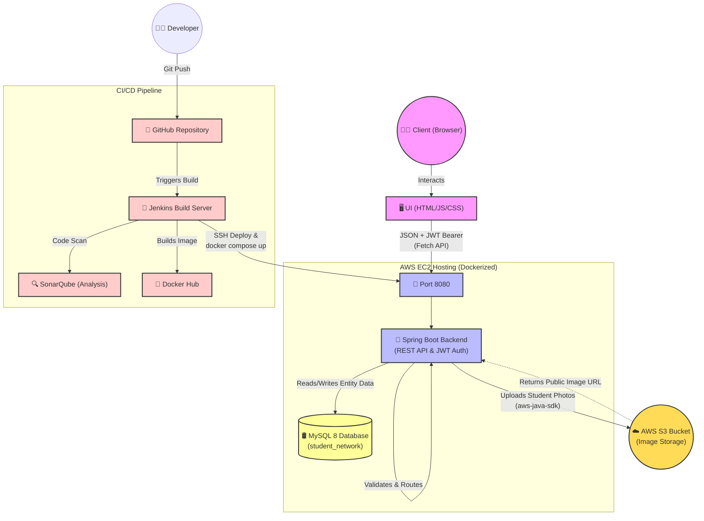

<h1 align="center">🎓 Student Management System</h1>

<p align="center">
  <b>A production-grade, full-stack application built with Spring Boot, Vanilla JS, and MySQL.</b><br>
  <i>Fully containerized and deployed using an automated Jenkins CI/CD pipeline to AWS.</i>
</p>

<p align="center">
  
  
  
  
  
  
</p>

---

## 🏗️ System Architecture & Workflow

Below is the comprehensive architecture diagram illustrating the request lifecycle, data flow, and deployment pipeline for the Student Management System.



---

## 🌟 Key Features

### 🔐 Security & Identity 
* **JWT Authentication:** Secure user logins and registrations.
* **Token-based API Protection:** All sensitive backend endpoints are locked behind Spring Security token verification.
* **Role-Based Users:** Safe administrative access.

### 👥 Student Management
* **Full CRUD Functionality:** Create, Read, Update, and Delete student records on the fly.
* **Dynamic Media Uploading:** Upload student profile photos instantly leveraging **AWS S3 Cloud Storage**.
* **Advanced Data Table:** Filter by variables, dynamically sort (Age ascending/descending, Default views, Skill matching), and perform seamless pagination.

### 🚀 DevOps & CI/CD
* **Dockerized Architecture:** Separated Spring Boot app and MySQL database living within a unified internal Docker bridge network (`student_network`).
* **Continuous Integration:** Fully automated Jenkins Pipeline (`Jenkinsfile`).
* **Code Quality Assurance:** Integrated **SonarQube** code analysis enforcing quality gates automatically on new commits.
* **Continuous Deployment:** Zero-downtime automated deployment to an AWS EC2 Ubuntu Host.

---

## ⚙️ How It Works (The Request Lifecycle)

1. **Client Interaction:** The user interacts with the `dashboard.html` UI.
2. **Security:** The vanilla JS `script.js` attaches a JWT (`Authorization: Bearer <token>`) to HTTP requests via the Fetch API.
3. **Backend Processing:** The Spring Boot `@RestController` intercepts the requests. Security filters validate the JWT.
4. **Cloud Integration:** If a photo is attached (via `multipart/form-data`), the service dispatches it autonomously using the AWS SDK directly to an S3 Bucket and saves the public URL.
5. **Persistence:** Entity data is mapped and processed natively using Spring Data JPA, running transactions against the internal MySQL Database container.

---

## 🚀 Running Locally

1. **Clone the repository:**
   ```bash
   git clone https://github.com/raghavendra2006/Student-Management.git
   cd Student-Management
   ```

2. **Supply AWS Environment Variables:**
   You must either add these inside of a `.env` file within the system directory, or inject them at runtime:
   ```env
   AWS_ACCESS_KEY_ID=your_access_key
   AWS_SECRET_ACCESS_KEY=your_secret_key
   AWS_S3_BUCKET=your_s3_bucket_name
   ```

3. **Start the Database & Application using Docker:**
   ```bash
   docker compose up -d
   ```

4. **Access the application:**
   - **Frontend UI:** [http://localhost:8080/signup](http://localhost:8080/signup)
   - **Backend API Testing / Health:** [http://localhost:8080/test](http://localhost:8080/test)

---

## 📜 API Documentation

### Auth Controllers
* `POST /auth/register` - Registers new user profiles.
* `POST /auth/login` - Authenticates and returns the `Authorization` JWT Bearer Token.

### App Controllers
* `POST /students` - Inserts students dynamically alongside file/image parameters.
* `GET /students` - Pulls standard raw array records.
* `PUT /students/{id}` - Modifies student records dynamically.
* `DELETE /students/{id}` - Wipes out records safely.
* `GET /students/filter` - Handles UI sorting and dynamic query parameters.

### Page Routes
* `GET /login`
* `GET /signup`
* `GET /dashboard`

---
*Architected and Developed by Raghavendra*
